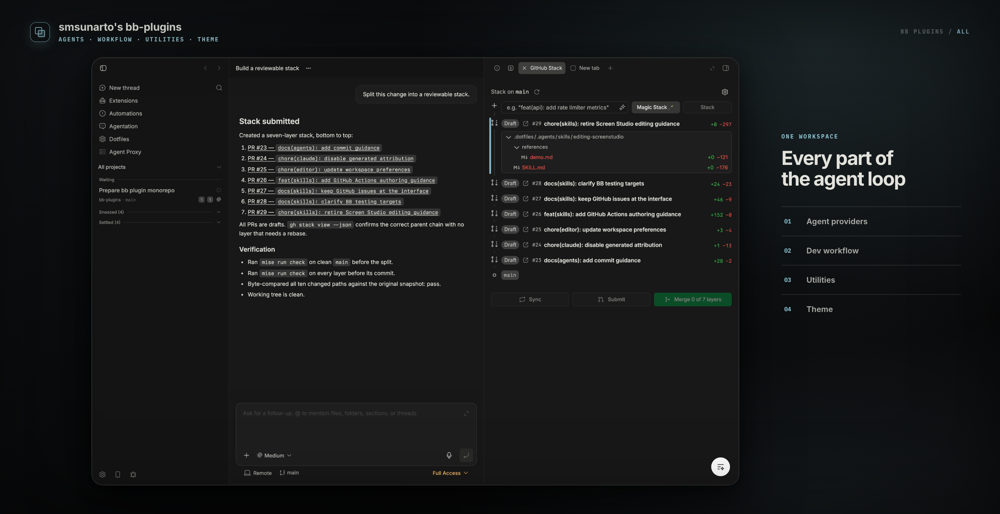

<div align="center">

# smsunarto's bb-plugins

**Plugins for [bb](https://github.com/get-bb/bb), the agent IDE — in one GitHub repository.**


</div>

<picture></picture>

### Agent Providers

<table>
<tr>
<td align="center" width="60"><picture><source media="(prefers-color-scheme: dark)" srcset="plugins/agent-proxy/assets/logo-dark.svg" /></picture></td>
<td align="center"><a href="plugins/agent-proxy/"><b>Agent Proxy</b></a></td>
<td>Pools several Claude Code and Codex subscriptions behind one local endpoint and load-balances across them, moving on when one hits its quota.</td>
</tr>
<tr>
<td align="center" width="60"><picture><source media="(prefers-color-scheme: dark)" srcset="plugins/amp/assets/logo-dark.svg" /></picture></td>
<td align="center"><a href="plugins/amp/"><b>Amp</b></a></td>
<td>Runs <a href="https://ampcode.com">Amp</a> as a native bb provider, locally or in an Orb.</td>
</tr>
</table>

### Dev Productivity

<table>
<tr>
<td align="center" width="60"><picture><source media="(prefers-color-scheme: dark)" srcset="plugins/agentation/assets/logo-dark.svg" /></picture></td>
<td align="center"><a href="plugins/agentation/"><b>Agentation</b></a></td>
<td>Turns a click on any part of bb into a structured annotation an agent can act on.</td>
</tr>
<tr>
<td align="center" width="60"><picture><source media="(prefers-color-scheme: dark)" srcset="plugins/gh-stack/assets/logo-dark.svg" /></picture></td>
<td align="center"><a href="plugins/gh-stack/"><b>GitHub Stack</b></a></td>
<td>Drives a <code>gh stack</code> from the thread panel — build, sync, submit, merge — and can hand the split to your agent.</td>
</tr>
<tr>
<td align="center" width="60"><picture><source media="(prefers-color-scheme: dark)" srcset="plugins/dotfiles/assets/logo-dark.svg" /></picture></td>
<td align="center"><a href="plugins/dotfiles/"><b>Dotfiles</b></a> ⚠️</td>
<td><b>Personal, unsupported.</b> Syncs one specific dotfiles repo layout. Not published to npm.</td>
</tr>
</table>

### Utilities

<table>
<tr>
<td align="center" width="60"><picture><source media="(prefers-color-scheme: dark)" srcset="plugins/notify/assets/logo-dark.svg" /></picture></td>
<td align="center"><a href="plugins/notify/"><b>Notify</b></a></td>
<td>Real macOS notifications from bb itself when a thread finishes or fails, plus a <code>notify_user</code> agent tool.</td>
</tr>
<tr>
<td align="center" width="60"><picture><source media="(prefers-color-scheme: dark)" srcset="plugins/t3sidebar/assets/logo-dark.svg" /></picture></td>
<td align="center"><a href="plugins/t3sidebar/"><b>t3sidebar</b></a></td>
<td>An action-oriented thread list with Next Action and Waiting sections. Forked from <a href="https://github.com/get-bb/bb/tree/main/examples/plugins/t3sidebar">bb's own example</a>.</td>
</tr>
</table>

### Themes

<table>
<tr>
<td align="center" width="60"><picture><source media="(prefers-color-scheme: dark)" srcset="plugins/monokai/assets/logo-dark.svg" /></picture></td>
<td align="center"><a href="plugins/monokai/"><b>bb Monokai</b></a></td>
<td>A dark Monokai-family palette for the whole app: one meaning per hue, a single text ladder, all 16 ANSI colors, and a matching diff viewer.</td>
</tr>
</table>

## Plugin authoring framework

This repository also develops **bb-kit**, an opinionated, agent-friendly
framework for bb plugin authors:

- [`@bb-kit/core`](packages/bb-kit/) provides typed native-RPC operations,
  TanStack Query integration, and realtime invalidation.
- [`@bb-kit/cli`](packages/bb-kit-cli/) provides additive generators,
  structural checks, inspection, identity/migration locks, and headless loaded
  operation invocation with committed JSON/YAML regression scenarios.
- The complete design and delivery boundaries live in the
  [bb-kit framework specification](docs/bb-plugin-framework-spec.md).

## Install

One command per plugin:

```sh
bb plugin install npm:@smsunarto/bb-plugin-<id>
```

`<id>` is the plugin's directory name — `agent-proxy`, `agentation`, `gh-stack`, `notify`, `amp`, `t3sidebar`, or `monokai`. For example:

```sh
bb plugin install npm:@smsunarto/bb-plugin-notify
```

## Build from source

This is also the git install route. It puts each plugin in as a **local path source**, so bb reads the files in place: edit, rebuild, reload — no reinstall. `bb plugin install git:<url>@<ref>` does not work for these plugins, because bb reads the manifest at the repository root and cannot see `plugins/<id>`.

```sh
git clone https://github.com/smsunarto/bb-plugins
cd bb-plugins
bun install                              # one hoisted node_modules at the repo root
bun run build                            # bb plugin build for every plugin
bb plugin install ./plugins/<id>         # from the repo root
```
