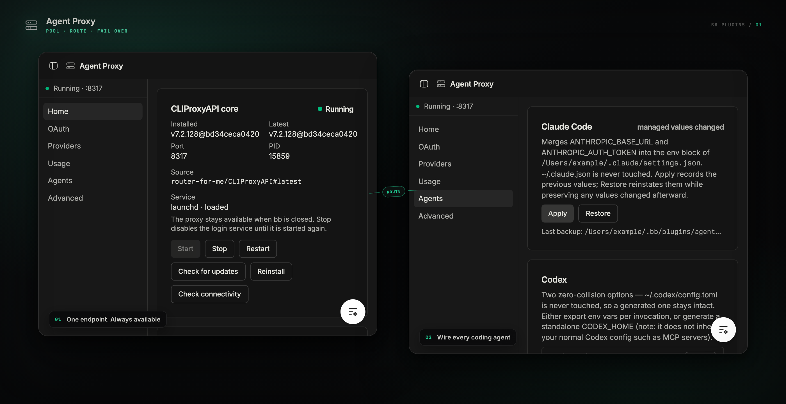

<div align="center">

<picture>
  <source media="(prefers-color-scheme: dark)" srcset="assets/logo-dark.svg" />
  
</picture>

# Agent Proxy

**Pool several Claude Code and Codex subscriptions, and load-balance across them.**


</div>

<picture></picture>

Agent Proxy installs [CLIProxyAPI](https://github.com/router-for-me/CLIProxyAPI) on
the machine that runs the bb server and gives it a management UI inside bb.

## Features

- **Pool several subscriptions** — authorize more than one Claude Code or Codex account and requests spread across every credential that matches the model. Round-robin by default; weighted and fill-first available.
- **Quota failover** — a 429 moves to the next account instead of failing the request.
- **One address for every provider** — Claude, Codex/ChatGPT, Gemini, and any OpenAI-compatible account on `http://127.0.0.1:8317`, translated across the OpenAI, Anthropic, and Gemini wire protocols.
- **Outlives bb** — the core runs as a login service, `launchd` on macOS and `systemd` on Linux, so it keeps serving after bb closes.
- **Green when it is up** — the sidebar row tints by core state: green running, amber starting or stopping, red crashed, dimmed when stopped.
- **One-click wiring** — point Claude Code, Codex, or anything else at the proxy without clobbering a config you generate yourself.
- **Opt-in Cursor endpoint.** Expose only the OpenAI-compatible `/v1` API through a Cloudflare Quick Tunnel for Cursor BYOK.
- **Installed and signed in from the panel** — one button for the core, browser OAuth for Claude and Codex, and each credential's quota state.

> **Stop is not permanent.** Stop disables the login job, but with `autostart` on
> (the default) the next bb start or `bb plugin reload` brings the core back. An
> enabled Quick Tunnel also keeps the core running. Turn both settings off for a
> stop that survives a reload.

| Client            | What Apply does                                                                                                                                                                         |
| ----------------- | --------------------------------------------------------------------------------------------------------------------------------------------------------------------------------------- |
| **Claude Code**   | Merges the base URL and token into `~/.claude/settings.json` after a timestamped backup. Restore reverts only the entries you have not since edited. `~/.claude.json` is never touched. |
| **Codex**         | Gives you a copy-ready command or a generated `CODEX_HOME`. Never edits `~/.codex/config.toml`.                                                                                         |
| **Anything else** | The plain base URL and API key.                                                                                                                                                         |

## Install

**From the marketplace** — add this repository once, then install by name:

```sh
bb marketplace add git:github.com/smsunarto/bb-plugins
bb plugin install agent-proxy
```

bb resolves the newest `agent-proxy/vX.Y.Z` tag and builds the plugin from it against
your bb, so the bundle always matches the host it runs on. `bb plugin update
agent-proxy` follows the same release line. If another marketplace you have added
publishes a `agent-proxy`, spell it `agent-proxy@smsunarto`.

**From source** — clone the repo and install the plugin as a local path
source. This is also how you install a change that is not released yet:

```sh
git clone https://github.com/smsunarto/bb-plugins.git
cd bb-plugins
bun install
bun run --filter '@smsunarto/bb-plugin-agent-proxy' build
bb plugin install ./plugins/agent-proxy
```

The source path needs Bun and the `bb` CLI. It installs the plugin as a **local
path source**, so bb reads the files in place: edit, rebuild, reload, with no
reinstall.

## First run

Open **Agent Proxy** in bb's sidebar, press **Install core**, then sign in under
**OAuth** or paste API keys under **Providers**.

These two steps stay manual on purpose. The core is a separate program that the
plugin fetches or builds on your machine, and OAuth sign-in opens a browser.

## Requirements

- **macOS** with `launchd`, or **Linux** with a `systemd --user` session. The plugin refuses to load on anything else.
- `tar` on `PATH`.
- **Go 1.26+** — only if you build from a non-release ref. A published release needs no toolchain.
- Outbound HTTPS to GitHub, to fetch the core.
- At least one upstream account: a Claude or ChatGPT subscription for the OAuth flows, or an Anthropic / OpenAI / Gemini / OpenAI-compatible API key.
- A free TCP port on loopback (8317 by default). A conflict shows up as a crash loop on the Home page.
- `cloudflared` on `PATH` or in a common install location. You need it only for the optional Cursor Quick Tunnel.

## Endpoints

| Protocol                   | Base URL                       |
| -------------------------- | ------------------------------ |
| OpenAI-compatible          | `http://127.0.0.1:8317/v1`     |
| Anthropic (`/v1/messages`) | `http://127.0.0.1:8317`        |
| Gemini                     | `http://127.0.0.1:8317/v1beta` |

The proxy listens on loopback of the bb server machine only.

## Use the Cursor Quick Tunnel

1. Install `cloudflared` on the bb server machine.
2. Enable **Cloudflare Quick Tunnel for Cursor** in Agent Proxy settings.
3. Open Agent Proxy Home and wait for **Public OpenAI base URL** to become ready.
4. Set Cursor's OpenAI base URL to the public URL from the card.
5. Set Cursor's OpenAI API key to the local API key from the same card.

The public URL ends in `/v1`. The gateway rejects every other path before it
reaches CLIProxyAPI. It also checks the local bearer key. CLIProxyAPI checks the
key again.

The helper runs as a login service and survives bb closing. Stop shuts down the
helper before it stops CLIProxyAPI. A port change updates the helper config but
keeps the current public hostname. A helper restart assigns a new hostname.

Quick Tunnels are for development. Cloudflare Quick Tunnels do not support SSE,
so Cursor requests that require SSE may fail. A temporary CLIProxyAPI outage
returns HTTP 503 through the existing public URL. This release has not verified
a live Cursor request.

## Commands

| Command                                | What it does                                                                       |
| -------------------------------------- | ---------------------------------------------------------------------------------- |
| `bb agent-proxy status`                | Core state, versions, local endpoints, tunnel state, and the ready public endpoint |
| `bb agent-proxy start`                 | Enable and start the login service                                                 |
| `bb agent-proxy stop`                  | Stop _and_ disable the login service                                               |
| `bb agent-proxy restart`               | Rewrite the definition if it changed, then restart                                 |
| `bb agent-proxy endpoints`             | Print local URLs, the local API key, tunnel state, and the ready public endpoint   |
| `bb agent-proxy install [ref]`         | Install the configured source, or a one-off ref without changing the saved setting |
| `bb agent-proxy oauth <claude\|codex>` | Start a browser OAuth flow and poll for up to 3 minutes                            |
| `bb agent-proxy providers`             | Count configured entries per collection, then list auth files                      |
| `bb agent-proxy usage`                 | Print the usage report as JSON                                                     |

## Settings

Configure Agent Proxy on its **Advanced** page. The plugin entry in bb Settings links to that page
instead of duplicating the form.

| Key                              | Default                     | Meaning                                                                              |
| -------------------------------- | --------------------------- | ------------------------------------------------------------------------------------ |
| `autostart`                      | `true`                      | Keep the login service enabled, so the core starts at login and survives bb closing  |
| `cloudflareQuickTunnelForCursor` | `false`                     | Expose the OpenAI-compatible `/v1` API through a development Quick Tunnel for Cursor |
| `port`                           | `8317`                      | Listen port. Out-of-range or unparseable values fall back to 8317                    |
| `sourceRepository`               | `router-for-me/CLIProxyAPI` | Public GitHub source                                                                 |
| `sourceBranch`                   | `latest`                    | `latest` resolves to the newest published release; or a branch, tag, or commit       |
| `managementKey`                  | _(generated)_               | Secret. Overrides the auto-generated management key                                  |
| `routingStrategy`                | `round-robin`               | Select credentials with round robin, fill first, or weighted round robin             |

Autostart applies immediately. The core reads the port and the management key only
at startup, so a change to either stops the service, rewrites `config.yaml`, and
restarts the service if it was running. A change made while the plugin is disabled
is applied on its next start.

## On disk

Everything lives under `<bb dataDir>/plugins/agent-proxy/`:

| Path                                 | Contents                                                                  |
| ------------------------------------ | ------------------------------------------------------------------------- |
| `core/auth/`                         | Your OAuth credentials                                                    |
| `core/secrets/`                      | Generated API keys                                                        |
| `backups/`                           | Timestamped copies of any file the plugin edits, taken before it writes   |
| `core/service/core.log`              | The log behind the Home page's tail                                       |
| `cloudflare-tunnel/desired.json`     | Plugin-owned helper config. It contains paths, not keys or the public URL |
| `cloudflare-tunnel/observation.json` | Helper-owned state and the current public origin                          |
| `cloudflare-tunnel/tunnel.log`       | Helper and `cloudflared` output                                           |

Credential and key files are written `0600`. Service definitions contain only
paths and service settings.

## Troubleshooting

- **Crash loop right after install** — usually a port conflict. Change `port`, or free 8317.
- **"Unavailable — is the core running?"** on OAuth, Providers, or Usage — those pages talk to the core's management API, so the core must be up first.
- **Removed the plugin, service still there** — the operating system owns the process by design. Run `bb agent-proxy stop` _before_ you remove the plugin, or delete the definition by hand.
- **macOS Gatekeeper kills the binary** — it should not be quarantined, but if it happens: `xattr -d com.apple.quarantine <core/bin/current/cli-proxy-api>`.
- **Tunnel says `cloudflared` is missing.** Install `cloudflared`, then disable and re-enable the setting.
- **Tunnel says the host runtime cannot run the helper.** Update or reinstall bb, then disable and re-enable the setting.
- **Tunnel stays on starting.** Read `cloudflare-tunnel/tunnel.log`. Cloudflare must be reachable from the bb server machine.
- **The public endpoint returns 401.** Use the local API key shown on Home as a bearer token.
- **The public endpoint returns 503.** Start the CLIProxyAPI core or resolve its port conflict. The helper keeps the public hostname while the core recovers.

## Develop from source

Install from source as shown under [Install](#install), then check a change
with:

```sh
bun run --filter '@smsunarto/bb-plugin-agent-proxy' typecheck
bun run --filter '@smsunarto/bb-plugin-agent-proxy' test
```

The test script needs Node 22.6+.
