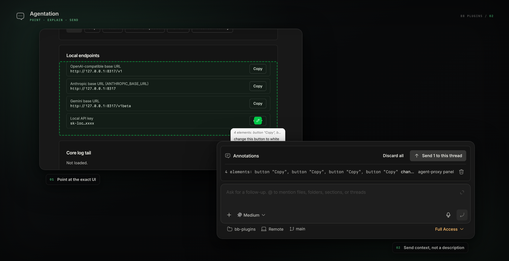

<div align="center">

<picture>
  <source media="(prefers-color-scheme: dark)" srcset="assets/logo-dark.svg" />
  
</picture>

# Agentation

**Point at the problem instead of describing it.**


</div>

<picture></picture>

Agentation puts a visual feedback toolbar over the whole bb interface — the app
shell and any surface another plugin drew. Click an element, write what should
change, and the annotation records the DOM selector, the React component path,
the bb route, the plugin that owns the element, and its public SDK UI
registration. An agent reads that, fixes the code, and resolves the annotation.
The marker disappears from every open bb window.

It is built on [Agentation](https://www.agentation.com) and its
[AFS 1.1](https://www.agentation.com/schema) annotation format. Agent tools are
registered natively, so there is no MCP server to run and nothing to configure
per agent. The toolbar talks to bb's own origin, so annotating through
`bb connect` works the same as annotating in the desktop app.

## What you get

| Surface                    | What it does                                                      |
| -------------------------- | ----------------------------------------------------------------- |
| Toolbar                    | Mounts over the whole bb app, on every route.                     |
| Thread composer banner     | Shows the staged batch in every open thread and assigns it there. |
| `Agentation` nav panel     | The backlog: triage, reply, resolve, dismiss, and re-stage.       |
| `agentation_*` agent tools | Nine tools for the read → fix → resolve loop.                     |
| `bb agentation`            | The same operations from a shell.                                 |
| `agentation` skill         | Teaches agents the loop.                                          |

## Install

**From the marketplace** — add this repository once, then install by name:

```sh
bb marketplace add git:github.com/smsunarto/bb-plugins
bb plugin install agentation
```

bb resolves the newest `agentation/vX.Y.Z` tag and builds the plugin from it against
your bb, so the bundle always matches the host it runs on. `bb plugin update
agentation` follows the same release line. If another marketplace you have added
publishes a `agentation`, spell it `agentation@smsunarto`.

**From source** — clone the repo and install the plugin as a local path
source. This is also how you install a change that is not released yet:

```sh
git clone https://github.com/smsunarto/bb-plugins.git
cd bb-plugins
bun install
bun run --filter '@smsunarto/bb-plugin-agentation' build
bb plugin install ./plugins/agentation
```

The source path needs Bun and the `bb` CLI. It installs the plugin as a **local
path source**, so bb reads the files in place: edit, rebuild, reload, with no
reinstall.

The toolbar appears in the bottom-right corner of bb. There is nothing else to
set up.

## Usage

**1. Point at it** — click the toolbar in the bottom-right corner of bb, then click
any element, including a plugin's own surface. Select several to annotate them
together, write what should change, and press **Add**.

**2. Send it to a thread** — the annotation lands in a shared staging area, and
every open thread shows the same batch above its composer. Send one annotation
from its row, mention it in the composer, or press **Send all** to send the full
batch. A mention removes that annotation from staging when the message is sent.
If the agent finishes without resolving it, the annotation returns to staging.

Choose **When sending to an active thread** in Agentation settings. **Default**
follows bb's **Steer running threads on Enter** setting. **Queue** waits behind
an active turn. **Steer** adds the feedback to the active turn. All three start
an idle thread.

Use the row action to discard one staged annotation, or **Discard all** to
discard the batch shown, after confirmation. Discarded feedback moves to the
panel's Dismissed view, where you can reopen it.

### What an annotation records

On top of the AFS fields, each annotation carries bb context, so an agent knows
where to look before it starts grepping.

| Field                          | Meaning                                                                                                                                                                  |
| ------------------------------ | ------------------------------------------------------------------------------------------------------------------------------------------------------------------------ |
| `bb.route`                     | The bb route the annotation was taken on.                                                                                                                                |
| `bb.pluginId`                  | Owning plugin, or `null` for the bb app shell.                                                                                                                           |
| `bb.surface`                   | Public SDK surface such as `navPanel`, `composer.banners`, `experimental_threadList`, or `threadPanelAction.component`; `inline` / `overlay` for trusted custom content. |
| `bb.surfaceId`                 | Registration/item id exposed by the surface, such as `inbox`; omitted on older annotations or when bb does not expose one.                                               |
| `bb.threadId` / `bb.projectId` | Source context resolved from the route.                                                                                                                                  |

### Commands

```
bb agentation pending [--plugin <id>] [--json]   every open annotation
bb agentation staged [--json]                    annotations waiting for a thread
bb agentation send <threadId> [annotationId…]    assign staged annotations
bb agentation restage <annotationId>             return one to staging
bb agentation sessions                           annotated pages
bb agentation show <annotationId>                one annotation in full
bb agentation acknowledge <annotationId>         mark as seen
bb agentation resolve <annotationId> [summary…]  mark as fixed
bb agentation dismiss <annotationId> <reason…>   decline, with a reason
bb agentation reply <annotationId> <message…>    ask the human a question
bb agentation toolbar [on|off]                   show or hide the toolbar
```

## Configuration

| Setting                           | Purpose                                     |
| --------------------------------- | ------------------------------------------- |
| Days to keep resolved annotations | Retention for the nightly prune. Default 7. |

Toolbar visibility is live state, not a setting. Toggle it with **Show toolbar**
/ **Hide toolbar** in the panel header, or with `bb agentation toolbar off`.

When Agentation has no saved theme, it starts with the opposite of bb's resolved
theme: light on dark bb, dark on light bb. Agentation's own theme control then
saves your choice, and later bb theme changes do not replace it.

## Troubleshooting

**The toolbar is not there.** Run `bb agentation toolbar on`, or use **Show
toolbar** in the panel header.

**An agent resolved an annotation but the marker is still on the page.** The
toolbar refreshes within about a second. While the annotation popup holds typed
text or the caret, the refresh waits, so that your draft is not lost. Finish or
close the note.

**An agent cannot find the feedback.** Staged annotations belong to no thread
yet. Send the batch to a thread, or tell the agent to call
`agentation_get_all_pending`, which reads across every page.

**Two panes sent the same batch.** The first pane assigns it. The second pane
refreshes instead of sending a duplicate. A failed delivery returns the batch to
staging.

## Develop from source

Install from source as shown under [Install](#install). Then run the watcher,
which rebuilds and reloads the plugin on every edit:

```sh
bb plugin dev plugins/agentation
bun run --filter '@smsunarto/bb-plugin-agentation' test
```
