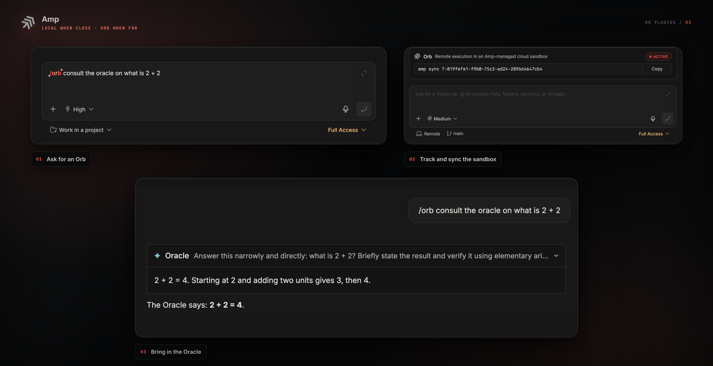

<div align="center">

<picture>
  <source media="(prefers-color-scheme: dark)" srcset="assets/logo-dark.svg" />
  
</picture>

# Amp

**Run [Amp](https://ampcode.com) in a bb thread, like any built-in provider.**


</div>

<picture></picture>

This plugin registers Amp as a native bb provider. The executable side is the
plugin's own provider bridge — its `bb.host` artifact — which spawns the Amp
CLI directly and drives it over its stream-json execute wire. Amp appears
in bb's provider list, runs against your bb environment by default, and can run
in an [Amp Orb](https://ampcode.com) cloud sandbox instead when you ask for one.

## Install

First make sure the [Amp CLI](https://ampcode.com/manual#get-started) is installed
and signed in — the plugin drives it and cannot install or authenticate it for you:

```sh
amp --version
amp login
```

**From the marketplace** — add this repository once, then install by name:

```sh
bb marketplace add git:github.com/smsunarto/bb-plugins
bb plugin install amp
```

bb resolves the newest `amp/vX.Y.Z` tag and builds the plugin from it against
your bb, so the bundle always matches the host it runs on. `bb plugin update
amp` follows the same release line. If another marketplace you have added
publishes a `amp`, spell it `amp@smsunarto`.

**From source** — clone the repo and install the plugin as a local path
source. This is also how you install a change that is not released yet:

```sh
git clone https://github.com/smsunarto/bb-plugins.git
cd bb-plugins
bun install
bun run --filter '@smsunarto/bb-plugin-amp' build
bb plugin install ./plugins/amp
```

## Requirements

- bb 0.40+ or a current bb nightly, on macOS or Linux. The plugin registers
  its provider through bb's plugin API, which bb 0.39 stable predates
- The **Amp CLI**, installed ([get started](https://ampcode.com/manual#get-started))
  and authenticated with `amp login`, or `AMP_API_KEY` exported in the
  environment bb runs in.
  The plugin locates and drives the CLI; it cannot install or sign in to it for you
- An Amp account

## Usage

Pick **Amp** in bb's provider list and start a thread. Everything below is
optional.

### Local and Orb

Amp runs against the bb environment's working directory. To use Amp Orb
instead, press the **Orb** toggle in the composer, then send the first prompt
of a new thread. The toggle shows only while Amp is the selected provider.
Pressing it arms Orb for the next thread and adds nothing to the prompt text.
An armed toggle expires after 10 minutes if no thread is started.

**Local or Orb is fixed for the life of the thread.** This matches Amp's own
model, where the executor is chosen at thread creation and cannot change
later. To move existing work to Orb, start a new thread with the toggle
pressed.

An Orb thread shows a bar above the composer with the Amp thread id and a copyable
`amp sync T-…` command. Run that in a local checkout to mirror the Orb's live
working-tree changes. Orb brings its own tools, permissions, skills, and MCP
config; bb terminals, files, and diffs still point at the bb environment you
selected.

### Archiving

Archiving an Amp-provider thread in bb also archives its linked Local or Orb
thread in Amp, and unarchiving it in bb brings that Amp thread back. Both
directions cover every bb surface — the sidebar menu, the archived view, and a
replaced sidebar such as GTD Sidebar, where settling archives and un-settling or
snoozing restores.

The two halves are not equally quick. bb announces an archive, so that half is
immediate; it announces no unarchive, so the plugin polls bb every 20 seconds
for threads it archived and gives the Amp thread back when one returns. A
restore that keeps failing — an Amp thread deleted on Amp's side, say — is
dropped after three attempts. Threads archived before this plugin version have
nothing recorded and are not restored.

### Modes

bb's picker offers one Amp model. Its reasoning levels — Low, Medium, High,
Ultra — are Amp's four modes, and the selected level becomes `--mode` on the
spawned CLI (`src/bridge/options.ts`).

### Permissions

bb's resolved thread permission controls Local Amp when the session starts:

- **Full** force-allows every Amp tool call (`amp.dangerouslyAllowAll`).
- **Accept Edits** explicitly disables Amp's force-all setting and uses Amp's
  normal permission rules. Amp does not provide an edit-only delegation mode;
  a rule with the `ask` action is rejected during this headless run.

Orb permissions stay in the Amp project settings.

### Fast

bb **Fast** starts a new Local Amp thread with the CLI's native `--fast`
feature. The plugin builds the CLI argv itself, so it adds `--fast` to a
thread's first execution when bb marked that thread Fast. Standard turns,
continued threads, version probes, and Orb executions are unchanged. Start a
new bb thread after selecting Fast; Amp's CLI cannot add Fast to an existing
Amp thread.

### Skills

Local Amp loads skills from its standard user and project directories. The
plugin registers Amp's direct native roots with bb, so those skills also appear
in bb's `/` menu. This covers `.agents/skills` and `.claude/skills` in the
workspace, plus Amp's direct user roots under `~/.config/agents`, `~/.agents`,
`~/.config/amp`, and `~/.claude`.

Amp still loads built-in and hosted skills, the recursive Claude plugin cache,
and directories configured through `amp.skills.path` itself. The static skill
roots on the provider registration do not cover those sources, so bb does not
index them.

### Current transport limits

Two bb controls do not reach Amp's execute wire and are not simulated:

- bb's generated project and host instructions are preserved at the start of
  the first Amp prompt. The wire carries no separate system or developer
  instruction input.
- Image input is disabled. The plugin sends text-only content blocks.

These need the execute wire to carry the input before this plugin can preserve
their native meaning.

### The Oracle card

When Amp calls its Oracle sub-agent, the thread shows a collapsible card with the
request, the response, and a trace that streams while it runs.

## Diagnostics

A healthy install does not need this command.

| Command         | What it does                                                                                                       |
| --------------- | ------------------------------------------------------------------------------------------------------------------ |
| `bb amp status` | Print every link in the chain: Amp CLI, bridge bundle, provider registration, legacy config entry, and auth |

```console
$ bb amp status
Amp CLI: /Users/you/.local/bin/amp
bridge bundle: /path/to/plugins/amp/dist/host.js
bb provider acp-amp: registered
legacy config entry amp: absent
auth: handled by the Amp CLI — run `amp login` once, or export AMP_API_KEY in your environment
```

## Troubleshooting

| Symptom                            | Fix                                                                                          |
| ---------------------------------- | -------------------------------------------------------------------------------------------- |
| Plugin shows "needs configuration" | Install the Amp CLI, run `amp login`, then `bb plugin reload amp`                            |
| Amp is not in the provider list    | `bb amp status` names the broken link                                                        |
| Auth errors in a thread            | `amp login`, or export `AMP_API_KEY` in the environment bb runs in                           |
| "Could not find a usable Amp CLI"  | The recorded `AMP_CLI_PATH` no longer exists. Reinstall Amp, then run `bb plugin reload amp` |
| Local tool calls rejected          | Use bb **Full** to force-allow all tools, or adjust Amp's own rules and use **Accept Edits** |
| Orb tool calls rejected            | Change the permission settings in the Amp project                                            |
| Orb opens the wrong repository     | Export `AMP_ACP_ORB_PROJECT` in the environment bb runs in, then start a new thread with `/orb` |
| `/orb` is rejected in a thread     | That Amp thread is already Local. Start a new bb thread with `/orb` in its first prompt      |
| `Unknown session <id>` on resume   | The session mapping was pruned or removed. Start a new thread                                |

## Develop from source

Install from source as shown under [Install](#install). `bun run build` in
`plugins/amp` produces `dist/server.js`, `dist/app.js`, and `dist/host.js`
(the provider bridge).

Never run `npm install` inside `plugins/amp`. The source checkout is a Bun
workspace, and a leaf npm install writes a second lockfile and `node_modules`
that shadow the workspace install.

`bb plugin install .` and `bb plugin dev` rebuild the frontend in place from the
published manifest entry, which drops the authored rules from `dist/app.css`.
Run `bun run build` again afterwards.

```sh
bun run typecheck
bun run test                # needs Node ≥ 22.6
```

Unit tests drive the bridge with scripted async generators, so they need no Amp
CLI and no network. The parity test replays the recordings under
`test/recordings/` through the real `dist/host.js` against a deterministic fake
Amp CLI, skipping itself when the bundle is unbuilt.
