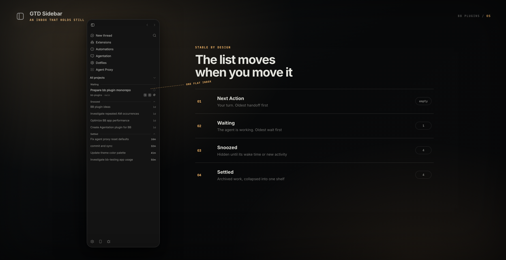

<div align="center">

<picture>
  <source media="(prefers-color-scheme: dark)" srcset="assets/logo-dark.svg" />
  
</picture>

# Eiff Sidebar

**A thread list organized by who can act next.**


</div>

<div align="center">
<picture></picture>
</div>

Eiff Sidebar replaces the scrolling thread list in bb's left sidebar with an inbox.

Active threads split into **Next Action** when the user can act and **Waiting** while
the agent works. Each section is oldest first. A thread that enters a section goes
to its bottom and holds that place until its next handoff.

While the sidebar stays mounted, this is exact entrance order. After an app reload,
bb does not provide historical section-entry times, so existing rows seed oldest
first from their last update time.

You clear the list with two email verbs: **snooze** a thread until a wake time, or
**settle** it when you are done. Both shelves collapse to one counted header.

## Install

This is a private fork, published nowhere. It installs as a **local path source**,
so bb reads the files where they sit: edit, rebuild, reload, with no reinstall.

```sh
cd ~/apps/bb-plugin-eiff-sidebar
bun install
cd plugins/eiff-sidebar
bb plugin build .
bb plugin install .
```

Needs Bun and the `bb` CLI. The workspace root carries nine other plugins from
upstream that this fork does not use; `bun install` there is what makes this one
build, and nothing else in the tree is installed into bb.

## Requirements

- bb 0.39+
- Nothing else. No accounts, keys, or external services.

## Usage

Installing does not change your sidebar by itself. Open **Settings → Appearance →
Sidebar** and choose **Eiff Sidebar (inbox)**.

<picture></picture>

bb's own list stays the default, and comes back the moment you switch away or
disable the plugin.

### Active and parked sections

- **Pinned** — the user's explicit priority, kept in its own shelf above active work.
- **Next Action** — the agent turn is done, an interaction needs input, or the thread is otherwise quiet. The oldest handoff is first.
- **Waiting** — foreground or background agent work is live. The oldest wait is first.
- **Snoozed** — hidden until the wake time you chose. A snoozed thread comes back early if it starts working or asks you something.
- **Settled** — work you are done with, collapsed to one line and shown for 24 hours. Settling also **archives the thread in bb**, so every other surface agrees, and new attention un-settles and unarchives it. After a day the row stops being drawn but stays archived.

An empty section disappears. A pending interaction stays in **Next Action** even if
background work is also live, because the user can act now.

### Cards

Two lines: the title in bold when unread and a status slot, then the project, the
branch, activity counts, PR number, and the agent (which you can turn off — see
[Configuration](#configuration)). The status slot shows what the
thread needs — failed, waiting on you, working, or finished while you were away —
and its age (`now`, `7m`, `3d`) when it needs nothing. Hovering swaps that slot for
the two park buttons.

**Double-click a card to rename its thread in place**, or pick Rename from the
right-click menu. Enter commits, Escape cancels, and clicking away also commits.
It is bb's own rename, so the new name lands on the thread itself and every other
surface showing it follows. An empty field cancels rather than clearing the title.
The first click of the double-click has already opened the thread, which is the
intent anyway: you rename the one you are now reading.

### A working thread can never be parked

Workflows, background agents, background commands, plan mode, and goals all count as
live work. Any of them blocks parking and wakes a parked thread, so running work is
never hidden.

### Snoozing

The hover button snoozes until **09:00 tomorrow**.

### Child threads

A flat list has nowhere to nest a child, so a child is hidden while its parent is on
screen. Two chips in the thread header carry the relation instead: on a parent, a
chip that opens its children and reads **Needs you** when one is blocked on you; on
a child, a chip that names the parent and opens it.

### The rest

- A project scope picker — the one control the plugin adds.
- Right-click for open in split, mark read/unread, pin, archive, delete.
- Drag a card to a split pane, or Cmd/Ctrl-click to open one.
- bb's search, its thread shortcuts, and modifier-click split-open all keep working.

## Configuration

One setting, in **Settings → Plugins → Eiff Sidebar**:

- **Show the agent icon on each card** — on. Turn it off to drop the trailing agent
  glyph and give the branch that space back. Every card follows it together, so the
  meta line keeps a straight right edge either way.

The snooze presets assume a 09:00 morning, an 18:00 evening, and a week starting
Monday, in your local timezone. The settled shelf reaches back 24 hours. None of
these are settings.

## Troubleshooting

**My sidebar looks the same after installing.** Choose Eiff Sidebar in Settings →
Appearance → Sidebar. Installing alone changes nothing.

**A thread I settled is not on the Settled shelf.** The shelf only reaches back 24
hours. Older work is still settled and still archived — look for it in bb's archived
view.

**A snoozed thread came back early.** That is the design: a snoozed thread wakes when
it starts working or asks you a question.

**Un-settling did not bring the thread back.** Archive and unarchive run on the
thread's host, which can be offline. When an unarchive fails, bb keeps the thread
archived and the thread leaves the sidebar until you unarchive it in bb yourself.

**Uninstalling left data behind.** The shelves live in the plugin's own database,
which bb removes with the plugin — but a copy of them is cached in the browser's
`localStorage` under `eiff-sidebar:v1:*` (thread ids, park timestamps, and provider ids,
names, and logo paths). bb's uninstall does not clear web storage. Clear site data if
that matters to you.

## Credits

Eiff Sidebar is a private fork of **GTD Sidebar** by **Scott Sunarto**, MIT
licensed, taken at release `gtd-sidebar/v0.4.1`. Everything the sidebar does was
his work; this fork adds rename and carries local changes. GTD Sidebar was itself
forked from bb's own example plugin and shipped as `t3sidebar` until 0.3.0.

bb keys a plugin by its id, so this one installs beside GTD Sidebar rather than
over it. Snoozed and settled shelves do not carry across: that state lives in each
plugin's own database and stays with it.

|          |                                                                                                                 |
| -------- | --------------------------------------------------------------------------------------------------------------- |
| Fork of | [`smsunarto/bb-plugins` → `plugins/gtd-sidebar`](https://github.com/smsunarto/bb-plugins/tree/main/plugins/gtd-sidebar) at `gtd-sidebar/v0.4.1` (`8bc27b91333e`) |
| Upstream | [`get-bb/bb` → `examples/plugins/t3sidebar`](https://github.com/get-bb/bb/tree/main/examples/plugins/t3sidebar) |
| Commit   | `f13c2d35f96540012b305f3b555839b30e1b6163` (2026-08-07)                                                         |

The provider brand marks are vendored SVG geometry from `get-bb/bb` and depict
third-party brands. A host-served logo always wins over them, rendered as a muted
silhouette rather than in brand color — by design.

## Develop from source

Install from source as shown under [Install](#install), then check a change
with:

```sh
cd plugins/eiff-sidebar
bun run typecheck
bun run test
bb plugin build . && bb plugin reload eiff-sidebar
```

Run them from the plugin directory, not the workspace root: the root scripts
filter on upstream's `@smsunarto/bb-plugin-*` scope and this fork is unscoped, so
they skip it. The test script needs Node 22.6+.

To pull an upstream release into the fork, fetch its tag and merge it; the
directory rename means git matches the files by content rather than by path:

```sh
git fetch origin --tags
git merge gtd-sidebar/vX.Y.Z
```
