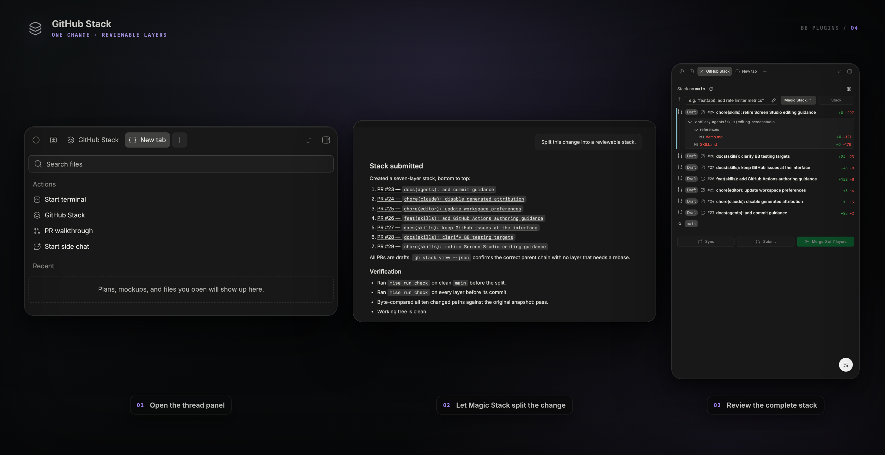

<div align="center">

<picture>
  <source media="(prefers-color-scheme: dark)" srcset="assets/logo-dark.svg" />
  
</picture>

# GitHub Stack

**Stacked pull requests, without the rebase choreography.**


</div>

<picture></picture>

[`gh stack`](https://github.com/github/gh-stack) is a GitHub CLI extension that
manages a chain of dependent branches, each with its own pull request stacked on
the one below it. This plugin puts that chain in bb's thread panel.

It runs `gh` and `git` in the thread's own workspace, so building, checking out,
syncing, submitting, merging, and pruning a stack all happen in the panel with no
terminal. **Magic Stack** goes one further and hands the split itself to the
thread's agent.

## Requirements

The plugin drives the GitHub CLI on the bb **server** host. It cannot install or
sign in to a third-party CLI for you, so do that once yourself:

```sh
gh extension install github/gh-stack
```

`gh` must already be installed and authenticated on that host (`gh auth status`).

## Install

**From the marketplace** — add this repository once, then install by name:

```sh
bb marketplace add git:github.com/smsunarto/bb-plugins
bb plugin install gh-stack
```

bb resolves the newest `gh-stack/vX.Y.Z` tag and builds the plugin from it against
your bb, so the bundle always matches the host it runs on. `bb plugin update
gh-stack` follows the same release line. If another marketplace you have added
publishes a `gh-stack`, spell it `gh-stack@smsunarto`.

**From source** — clone the repo and install the plugin as a local path
source. This is also how you install a change that is not released yet:

```sh
git clone https://github.com/smsunarto/bb-plugins.git
cd bb-plugins
bun install
bun run --filter '@smsunarto/bb-plugin-gh-stack' build
bb plugin install ./plugins/gh-stack
```

The source path needs Bun and the `bb` CLI. It installs the plugin as a **local
path source**, so bb reads the files in place: edit, rebuild, reload, with no
reinstall.

## Usage

Open a thread, open its side panel, then press **New tab** and pick **GitHub
Stack** under Actions.

**The rail**

Layers stack top-first above the trunk, each with its PR link, title, state, and a
`+N −M` delta. Click a row to check it out. Merged layers disappear.

**Draft ⇄ ready**

Click an Open or Draft pill to flip it.

**Changed files**

The delta chip expands into a file tree. Each layer is diffed against its stack
parent, so you see only what it adds.

**Adding a layer**

Type a PR-style name — _"Add rate limiting to the API"_ — and the branch name is
derived as you type. **Suggest** drafts a title from your changes.

**Magic Stack**

Hands the split to the thread's own agent: it inspects the workspace, designs the
layers, builds them, opens draft PRs, and reports back with what it made and how it
checked each one.

**Sync, Submit, Merge, Prune**

Each button enables itself from the stack's real state, and its tooltip says why.
Submit becomes **Sync + Submit** when the stack needs restacking. Merge takes the
ready run from the trunk up, stopping at the first draft or closed PR.

> **Checkout protects your work.** Tracked changes that block a checkout are
> stashed and restored when you return to that branch; the layer shows a `stashed`
> chip meanwhile. Untracked files are never stashed — an untracked blocker aborts
> instead, and your own stashes are never touched.

## Settings

Open the gear at the right edge of the panel header. Both settings are global to
the plugin, not per repository.

| Key                   | Default            | Meaning                                                                                                                                                                                                                                                      |
| --------------------- | ------------------ | ------------------------------------------------------------------------------------------------------------------------------------------------------------------------------------------------------------------------------------------------------------ |
| `branchPrefix`        | _(empty — detect)_ | Namespace prepended to every derived branch. Empty means "match this workspace": the namespace the stack's own branches share, else the checked-out branch's. A missing separator is added (`team` → `team/`); a value that cannot form a branch is rejected |
| `conventionalCommits` | `false`            | Titles read `feat(api): add rate limiting`. The type leads the branch slug and the scope is dropped from it                                                                                                                                                  |

The popup shows a live example of the branch the composer would build.

## Troubleshooting

`gh stack` exit codes are mapped to messages rather than surfaced raw:

| Symptom                   | Meaning                                                                           |
| ------------------------- | --------------------------------------------------------------------------------- |
| "not a stack"             | The current branch is not part of one. Only reported when `gh` explicitly says so |
| "rebase conflict"         | Exit 3 or 7 — sync stopped mid-rebase                                             |
| "GitHub API failure"      | Exit 4                                                                            |
| "stack file locked"       | Exit 8 — another `gh stack` is running                                            |
| "stacked PRs not enabled" | Exit 9 — enable them on the repository                                            |
| "gh not found"            | The CLI is missing on the **server** host, not your laptop                        |

Recoverable sync failures — rebase conflicts, unfinished rebases, local/remote
divergence, known topology conflicts — are handed to the thread's agent with a
10-minute recovery lease on the repository. Authentication, API, timeout,
missing-CLI, and push failures stay explicit errors instead of starting an agent
turn.

## Develop from source

Install from source as shown under [Install](#install), then check a change
with:

```sh
bun run --filter '@smsunarto/bb-plugin-gh-stack' typecheck
bun run --filter '@smsunarto/bb-plugin-gh-stack' test
```

The test script needs Node 22.6+.
