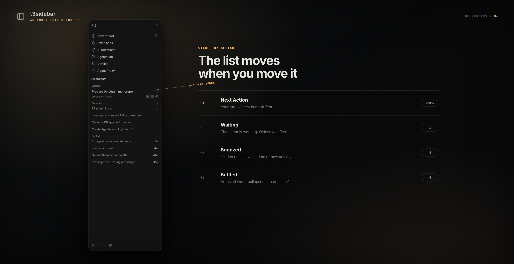
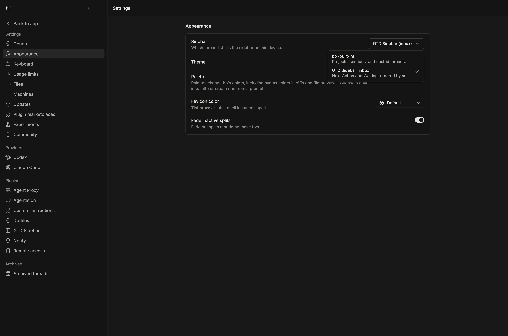

<div align="center">

<picture>
  <source media="(prefers-color-scheme: dark)" srcset="assets/logo-dark.svg" />
  
</picture>

# GTD Sidebar

**A thread list organized by who can act next.**


</div>

<div align="center">
<picture></picture>
</div>

GTD Sidebar replaces the scrolling thread list in bb's left sidebar with an inbox.

Active threads split into **Next Action** when the user can act and **Waiting** while
the agent works. Every section shows the most recently updated thread first.

You clear the list with two email verbs: **snooze** a thread until a wake time, or
**settle** it when you are done. Settle archives the thread in bb, and bb's Undo toast
brings it back. The Snoozed and Settled shelves collapse to one counted header each.

## Install

**From the marketplace** — add this repository once, then install by name:

```sh
bb marketplace add git:github.com/smsunarto/bb-plugins
bb plugin install gtd-sidebar
```

bb resolves the newest `gtd-sidebar/vX.Y.Z` tag and builds the plugin from it against
your bb, so the bundle always matches the host it runs on. `bb plugin update
gtd-sidebar` follows the same release line. If another marketplace you have added
publishes a `gtd-sidebar`, spell it `gtd-sidebar@smsunarto`.

**From source** — clone the repo and install the plugin as a local path
source. This is also how you install a change that is not released yet:

```sh
git clone https://github.com/smsunarto/bb-plugins.git
cd bb-plugins
bun install
bun run --filter '@smsunarto/bb-plugin-gtd-sidebar' build
bb plugin install ./plugins/gtd-sidebar
```

The source path needs Bun and the `bb` CLI. It installs the plugin as a **local
path source**, so bb reads the files in place: edit, rebuild, reload, with no
reinstall.

## Requirements

- bb 0.43.1+
- Sidebar organization needs nothing else.
- Thread naming needs an existing Codex login on bb's primary host.

## Usage

Installing does not change your sidebar by itself. Open **Settings → Appearance →
Sidebar** and choose **GTD Sidebar (inbox)**.

<picture></picture>

bb's own list stays the default, and comes back the moment you switch away or
disable the plugin.

### Active and parked sections

- **Pinned** — the user's explicit priority, kept in its own shelf above active work.
- **Next Action** — the agent turn is done, an interaction needs input, or the thread is otherwise quiet.
- **Waiting** — foreground or background agent work is live, in the thread or in any of its subthreads. A family moves back to Next Action only when one of its threads asks you something.
- **Snoozed** — hidden until the wake time you chose. A snoozed thread comes back early if it starts working or asks you something.

Pinned follows bb's own pinned order — the same order the built-in sidebar
drags by — so a pin moved there lands in the same place here. Every other
section orders threads by when they arrived on it, newest first, and a
thread keeps its spot while it stays put: a turn starting, a read, a rename, or
child activity never reshuffles it. Only a shelf change moves it, to the top of
the new shelf. Snoozed sorts by the moment you snoozed and Settled by the
moment it settled; expand Snoozed to see that order.

An empty section disappears. A pending interaction stays in **Next Action** even if
background work is also live, because the user can act now.

### Project groups

Once threads from two or more projects are in view, every shelf splits into
project groups: a header naming the project, then that project's threads. A
machine filter keeps these headers visible even when that machine has threads
in only one project, so the repository context is not lost. Use the folder
button beside the machine picker to hide or restore repository groups; the
choice persists across reloads. The project selector appears only while
repository grouping is off, and restoring groups clears that project scope. The
header folds the group; a folded header shows `needs-you / total` while
something inside asks for you, and the total alone otherwise. Hovering the
header shows a **+** that opens the project's new-thread screen. Shelf and
group headers stay pinned while their rows scroll.

Groups follow bb's project order in every shelf, with your personal project
last. Drag a group header onto another group to drop its project in that
slot — or right-click it for **Move up** and **Move down**, the keyboard
path. Both reorder the project in bb itself, so every shelf agrees and bb's
own project lists follow along. The personal project's group never drags and
nothing lands after it.

The shelf still comes first: the same project appears under Next Action and
under Waiting when it has work in both, and folding it in one shelf leaves it
open in the other. A subthread stays under its parent even when it belongs to another
project. With a single project in view there are no headers at all.

A thread's title never shares its line with a project name. Remote threads
lead with a globe in their machine's colour instead.

### Cards

Two lines: the title in bold when unread and a status slot, then the project, the
branch, activity counts, PR number, and optional agent icons (enable them in
[Configuration](#configuration)). The status slot shows what the
thread needs — failed, waiting on you, working, or finished while you were away —
and its age (`now`, `7m`, `3d`) when it needs nothing. Hovering swaps that slot for
the park buttons.

### A working thread can never be snoozed

Workflows, background agents, background commands, plan mode, and goals all count as
live work. Any of them blocks snoozing and wakes a snoozed thread, so running work is
never hidden.

### Snoozing

The hover button snoozes until **09:00 tomorrow**.

### Settling

The check button, the card menu, and the **GTD Sidebar: settle thread** row in bb's
quick palette all archive the thread in bb. bb's Undo toast brings it back. Settling
the open thread moves you to the next row in its section.

The **Settled** shelf lists every thread archived in the last 24 hours, whether it was
settled here or archived from bb's own sidebar. The hover button un-settles it, which
unarchives the thread in bb. After a day a thread stops being drawn on the shelf and
stays in bb's archive.

### Child threads

A child sits under its parent with a disclosure chevron. Folding a family uses bb's
own `sidebar.collapsedThreads` preference, so a family folded here is folded in bb's
built-in sidebar too, and the fold survives a reload. Folded project groups stay
session state.

Drag a row onto another row to nest it there, or onto a project group header
to lift it back to the top level. The move is bb's own parent change, so bb's
sidebar follows it. A row never drops onto itself, its current parent, anything
inside its own family, or a thread in another project; a row that cannot take
the drop shows no highlight. With the keyboard, Space picks the focused row up,
the arrows move it between targets, Space drops, and Escape cancels.

The same drag is still bb's drag-to-split gesture: a drag that stays in the
sidebar nests, a drag out to the main area splits. Nothing needs a modifier.
Desktop only.

### Thread names

With **Automatically name threads** enabled, a root thread gets a GTD-generated name on its first user prompt, replacing any
initial title supplied by BB. First-request inference can only generate a new
title, never keep BB's title. Later prompts keep the existing title unless you clearly start completely different work. Follow-ups,
corrections, tests, debugging, screenshots, commits, and shipping for the same
task keep its title. When the task change is uncertain, the title stays unchanged.
Queued prompts are checked when dispatched. New threads wait for their workspace
to be ready so the first title includes project naming rules. Agent replies and turn completion do
not trigger naming. New titles are plain text with no activity emoji. Prefixes
and other project formatting come only from your naming rules. Existing titles
are preserved exactly when the decision is to keep them.

The plugin sends a tool-free prompt to GPT-5.6-Luna with reasoning disabled and
asks for a keep-or-rename decision with the complete title. The first request, an
untitled thread, and explicit regeneration use a generation prompt that can only
rename. Later requests use a review prompt that sees the current title and may
keep it, and a keep decision does not write to the thread. Both prompts carry the
latest request, the original request, up to three recent requests, and your
project naming rules. A transient failure retries once with GPT-5.6-Luna, and each
attempt has a five-second deadline. Logs record timing, never the prompt.

Run the **configure-gtd-naming** skill to create or update
`.agents/GTD_NAMING.md` in your project. The skill inspects the project, chooses
compact naming rules, and writes the file. Scopes are configured there instead
of inferred automatically for every title. You can also edit the file directly:

```md
Use [GTD] for sidebar work and [Vimium] for keyboard navigation.
For work spanning both, use [GTD + Vimium]. Otherwise use a plain title.
Keep prefixes out of the task text.
```

The plugin reads the file from the active workspace on every naming request and
injects up to 500 characters of whole lines. The setup skill keeps the entire file
within that budget. An empty or non-UTF-8 file uses default instructions.

To replace a title by hand, run `bb gtd-sidebar rename [<threadId>]`. The command
uses the current thread when you omit the id. Explicit regeneration can replace a title even when
the task has not changed.

### The rest

- A project scope picker — the one control the plugin adds.
- Right-click a row to settle, snooze, pin, or delete it.
- On a phone, hold a row for half a second (iOS's own long-press timing) for the same
  menu, drawn as an iOS-style frosted sheet. Menu taps can play a haptic on iOS when enabled in settings.
- Drag a card to a split pane, or Cmd/Ctrl-click to open one.
- Drag a card onto another to nest it, or onto a project header to un-nest it.
- Drag a project group header onto another group to reorder the project in bb.
- bb's search, its thread shortcuts, and modifier-click split-open all keep working.

## Configuration

Choose enhancements in **Settings → Plugins → GTD Sidebar**. All optional
booleans default **off**, including while settings are loading. The SDK stores
these preferences on the server and updates open clients when they change.

### Feature catalog

Core means available when you select GTD Sidebar in Appearance. Core actions run
only when you use them, apart from reads and clocks needed to keep the inbox
accurate. Normal inbox behavior does not invoke an AI model or poll external
services. The explicit naming command below is a separate user-requested inference.

| Core sidebar feature       | What it does                                                                                                                                                                               |
| -------------------------- | ------------------------------------------------------------------------------------------------------------------------------------------------------------------------------------------ |
| Action shelves             | Pinned, Next Action, Waiting, Snoozed, and the last 24 hours of Settled. Running work and pending interactions stay visible.                                                               |
| Repository groups          | Group shelves by BB repository, keep repository context under machine filters, toggle groups from the sidebar, fold groups, create a thread from a group, and reorder groups.              |
| Thread families            | Fold using BB's shared preference. Desktop drag or keyboard drag nests/un-nests threads using BB's parent relation.                                                                        |
| Thread actions             | Pin, snooze until tomorrow at 09:00, settle/archive with native Undo, restore, delete, and insert a thread reference into the composer.                                                    |
| Navigation                 | Row click, search, repository and machine scope pickers, Cmd/Ctrl-click split-open, and drag-to-split. Preserve BB/Vimium thread shortcut anchors.                                         |
| Status and details         | Unread titles, activity indicators/counts, time, native branch and PR information, provider tooltips, machine globe/color and host identity. These make thread state and location visible. |
| Mobile and compact layouts | Mobile/subthreads use one-line rows. Long-press opens the action sheet without requiring haptics. Desktop roots use two-line cards by default.                                             |
| Explicit naming command    | `bb gtd-sidebar rename [<threadId>]` is an explicit request for Codex title inference even with automatic naming off.                                                                      |

| Optional setting (key)                                  | Default | Effect when enabled                                                                                                                                                                                            |
| ------------------------------------------------------- | ------- | -------------------------------------------------------------------------------------------------------------------------------------------------------------------------------------------------------------- |
| Compact thread rows (`compactThreads`)                  | Off     | One-line desktop root rows. Mobile/subthreads remain compact either way.                                                                                                                                       |
| Show agent icons (`showProviderIcon`)                   | Off     | Provider glyph on two-line cards. Provider identity remains in tooltips/menus when off.                                                                                                                        |
| Enable mobile haptics (`mobileHaptics`)                 | Off     | Attach iOS tactile menu-tap switches. Turning off removes those switches, including from an open menu.                                                                                                         |
| Show GitButler branches (`gitButlerBranches`)           | Off     | Periodically read GitButler branches on primary checkouts through the host CLI. Off stops refreshes and server host reads, restoring BB's native labels.                                                       |
| Automatically name threads (`automaticallyNameThreads`) | Off     | Infer titles on user requests through the existing Codex login. Sends request context and naming rules. Off skips automatic context reads/inference and prevents an in-flight result from renaming the thread. |
| Enable Projects coordination (`projectsEnabled`)        | Off     | Projects rail, creation/forms, coordinator and delegated agents, shared context, workspace bindings, tools and mentions. This is separate from core repository grouping.                                       |
| Enable Project subscriptions (`subscriptionsEnabled`)   | Off     | Requires Projects too. Enables scheduled prompts and GitHub/Slack polling/delivery, subscription forms, Listening toolbar and agent subscription tools. Deliveries can start agent work.                       |

| Supporting preference             | Default       | Purpose                                                                                                                                |
| --------------------------------- | ------------- | -------------------------------------------------------------------------------------------------------------------------------------- |
| Local machine (`localMachineId`)  | Empty         | Choose which machine's threads omit the globe. This does not move threads or change their execution host.                              |
| Slack bot token (`slackBotToken`) | Empty, secret | Credential for Slack subscriptions. Saving a token does not enable Projects or subscriptions. Never exposed through frontend settings. |

### Opt-in and migration behavior

- Existing **explicit saved values** keep their meaning, including saved `true`
  for automatic naming, icons or compact rows. We retain the original keys and
  use SDK effective values. We do not infer consent from a token or existing data.
- Previously implicit defaults for automatic naming and icons become **off**.
  Projects, GitButler branch lookups and haptics now require an explicit opt-in.
  No migration writes `true` on an existing or new installation.
- Disabling Projects preserves its registry, workspace bindings, shared documents
  and subscriptions. Coordinator/child threads return to ordinary inbox shelves.
  Native BB still owns thread and environment lifecycle. Disabling does not stop
  agents already running, archive threads, or delete environments.
- Disabling either Projects or subscriptions blocks new polls and delivery,
  including delivery after a poll already in flight. Already-issued network or
  agent requests cannot be recalled. Stored subscriptions retain their individual
  enabled flags and cursors. Re-enabling resumes the engine: overdue one-shot
  schedules and pending events may deliver. Review subscriptions before opting in.
- Disabled Project RPCs and agent tools reject calls from stale tabs/sessions.
  New agent configurations omit Project instructions/tools. Native archive/delete
  bookkeeping continues so the saved registry stays consistent.
- The SDK's navigation and panel-launcher entries are static. The **Projects**
  entry remains discoverable while off, but opens an explanation instead of
  loading project data or forms. Thread chips, composer toolbar and rail unmount.
- Settings take effect without a plugin reload. The selected sidebar itself stays
  BB's explicit Appearance preference.

See [Projects details](PROJECTS.md) for the coordination, shared-directory and
subscription workflows. Enable only the parts you want.

## Troubleshooting

**My sidebar looks the same after installing.** Choose GTD Sidebar in Settings →
Appearance → Sidebar. Installing alone changes nothing.

**A snoozed thread came back early.** That is the design: a snoozed thread wakes when
it starts working or asks you a question.

**Uninstalling left data behind.** Snoozes live in the plugin's own database,
which bb removes with the plugin. Earlier versions also cached them in the
browser's `localStorage` under `gtd-sidebar:v1:*`. This version removes those
entries the first time it loads, so nothing stays behind.

## Credits

Forked from bb's own example, and released as `t3sidebar` until 0.3.0. bb keys a
plugin by its id, so the renamed plugin installs as a separate one: install
`gtd-sidebar`, then uninstall `t3sidebar`. Snoozes do not carry over — they live in
the old plugin's database and go with it.

|          |                                                                                                                                                                                |
| -------- | ------------------------------------------------------------------------------------------------------------------------------------------------------------------------------ |
| Upstream | [`get-bb/bb` → `examples/plugins/t3sidebar`](https://github.com/get-bb/bb/tree/f13c2d35f96540012b305f3b555839b30e1b6163/examples/plugins/t3sidebar)                            |
| Commit   | `f13c2d35f96540012b305f3b555839b30e1b6163` (2026-08-07)                                                                                                                        |
| Status   | Upstream removed the example in `9d0b8a9d5` (2026-08-20, #2143). Its last four commits only renamed the SDK package and raised the engines floor, both already reflected here. |

Thread naming adapts the lifecycle design from
[`suiramdev/bb-plugin-thread-namer`](https://github.com/suiramdev/bb-plugin-thread-namer)
at commit `023d1229db020330a940e4bff060e23bd4b278d8`.

The provider brand marks are vendored SVG geometry from `get-bb/bb` and depict
third-party brands. A host-served logo always wins over them, rendered as a muted
silhouette rather than in brand color — by design.

## Develop from source

Install from source as shown under [Install](#install), then check a change
with:

```sh
bun run --filter '@smsunarto/bb-plugin-gtd-sidebar' typecheck
bun run --filter '@smsunarto/bb-plugin-gtd-sidebar' test
```

The test script needs Node 22.6+.
