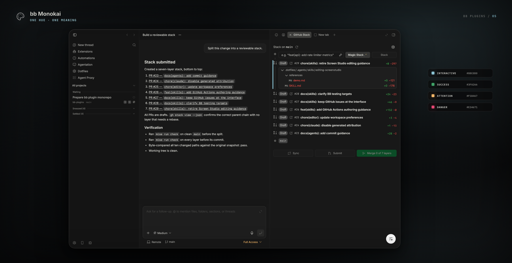
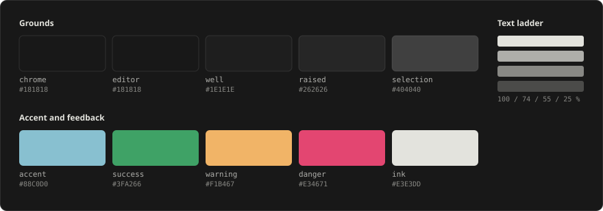

<div align="center">

<picture>
  <source media="(prefers-color-scheme: dark)" srcset="assets/logo-dark.svg" />
  
</picture>

# bb Monokai

**A dark Monokai palette for bb, terminal included.**


</div>

<picture></picture>

bb draws itself from CSS custom properties, so a theme is just a stylesheet.
This plugin adds one: **bb Monokai**, a dark palette built on a five-step
grounds ramp, a single off-white text ladder, and one accent that always means
_interactive_.

It reaches past the app chrome: the terminal, the diff viewer, the file tree's
git-status column, inline code, and the syntax tokens inside diffs and file
previews all draw from the same palette rather than keeping bb's defaults.

## Install

**From the marketplace** — add this repository once, then install by name:

```sh
bb marketplace add git:github.com/smsunarto/bb-plugins
bb plugin install monokai
bb theme set plugin:monokai:bb-monokai
```

bb resolves the newest `monokai/vX.Y.Z` tag and builds the plugin from it against
your bb, so the bundle always matches the host it runs on. `bb plugin update
monokai` follows the same release line. If another marketplace you have added
publishes a `monokai`, spell it `monokai@smsunarto`.

**From source** — clone the repo and install the plugin as a local path
source. This is also how you install a change that is not released yet:

```sh
git clone https://github.com/smsunarto/bb-plugins.git
cd bb-plugins
bun install
bun run --filter '@smsunarto/bb-plugin-monokai' build
bb plugin install ./plugins/monokai
bb theme set plugin:monokai:bb-monokai
```

The source path needs Bun and the `bb` CLI. It installs the plugin as a **local
path source**, so bb reads the files in place: edit, rebuild, reload, with no
reinstall.

## Usage

Installing the plugin only adds the palette. The `bb theme set` line above is
what selects it. You can also switch in bb under
**Settings → Appearance → Palette**:

Disabling or removing the plugin returns bb to the default palette.

## Requirements

- bb 0.39+ — the line that lets a theme declare its own code theme
- bb set to **dark** appearance. The palette only restyles `.dark`; light mode
  keeps bb's defaults.
- Optional: **Berkeley Mono**. It is _not_ bundled. Install it yourself and the
  type stack picks it up. Without it the
  stack falls back to `ui-monospace`, Menlo, then `monospace`. The terminal
  additionally prefers `BerkeleyMono Nerd Font Mono` when present.

## The palette

<picture></picture>

| Role                | Value                 | Where it lands                                                                 |
| ------------------- | --------------------- | ------------------------------------------------------------------------------ |
| Chrome ground       | `#141414`             | cards, popovers, sidebars, terminal ground                                     |
| Editor ground       | `#181818`             | the main pane                                                                  |
| Sidebar divider     | `#2B2B2B`             | solid 1px boundary between navigation and content                              |
| User message bubble | `#1E1E1E`             | right-aligned user requests                                                    |
| Composer            | `#1E1E1E`             | prompt input and controls                                                      |
| Well                | `#1E1E1E`             | recessed and code wells, text fields, selectors; controls use a `#3C3C3C` edge |
| Raised              | `#262626`             | hover and active fills                                                         |
| Filled buttons      | `#363635` / `#1E1E1E` | borderless primary / `#3C3C3C`-bordered secondary buttons                      |
| Selection           | `#404040`             | text selection, chips                                                          |
| Ink                 | `#E3E3DD`             | the one white; every text tier is an alpha of it                               |
| Accent              | `#88C0D0`             | the only chroma in the chrome — always means interactive                       |
| Success / added     | `#3FA266`             |                                                                                |
| Warning / attention | `#F1B467`             |                                                                                |
| Danger / removed    | `#E34671`             |                                                                                |
| Merged              | `#B267E6`             |                                                                                |

**One meaning per hue.** A color never does two jobs. Text is one white at four
alphas (100 / 74 / 55 / 30 %), each annotated inline with its measured contrast
ratio against the ground it sits on.

## What it restyles

| Surface              | Notes                                                                                 |
| -------------------- | ------------------------------------------------------------------------------------- |
| App chrome           | panes, panels, sidebar, menus, buttons, mention pills, focus rings                    |
| Terminal             | all 16 ANSI colors plus 16 companion foreground tokens, one per ANSI background       |
| Diff viewer          | addition / deletion / modified colors, gutter number grounds and role-colored numbers |
| Syntax tokens        | the Cursor Monokai TextMate layer, in diffs and file previews                         |
| File tree            | the git-status column — added, untracked, renamed, modified, deleted, ignored         |
| Inline code          | the sugar-high token set, measured on the `#1E1E1E` well                              |
| Composer stop button | repainted to the danger hue                                                           |

### Syntax tokens

Token colors are not a CSS surface — Shiki writes an inline style on every span
inside a shadow root. bb 0.38 answers that with a manifest field that picks the
Shiki theme, so the plugin ships one: `themes/bb-monokai-code.json`, the same
TextMate layer as the Cursor Monokai editor theme. One hue per kind — pink machinery, cyan structure, green
callables, yellow literals, purple constants, gray commentary, white for
everything else.

Only the dark side is declared, so light mode keeps bb's `pierre-light`. A
diff has no language server behind it, so this is the TextMate layer alone:
tokens an editor colors from semantic tokens (a plain parameter, a declaration
in bold) stay at their TextMate color here.

## Troubleshooting

**The app still looks the same.** The palette has to be selected. Run
`bb theme set plugin:monokai:bb-monokai`, or pick **bb Monokai** under
**Settings → Appearance → Palette**.

**Only part of the app changed.** Check that bb is in dark appearance. In light
mode the palette contributes fonts only.

**Some surfaces stay off-palette.** CSS cannot reach them:

- **File-type icons.** Their 13 source swatches are declared on `:host`, so all
  48 language icons collapse to a single color.
- **Terminal font size and cursor blink.** Both are xterm constructor
  arguments, not tokens. Terminal selection alpha is clamped by the host.
- **Mermaid diagrams** keep a hardcoded Inter font. Colors follow the palette
  on the next render.
- **The favicon tint** comes from a fixed list, with no CSS involved.
- **Built-in bb plugin panels** (tasks, docs, github, workflows, memory) ship
  their own bundles with raw scale colors.

## Develop from source

Install from source as shown under [Install](#install). The shipped CSS is
generated from the TypeScript palette and a selector-focused template:

```sh
$EDITOR plugins/monokai/scripts/generate-theme.ts
$EDITOR plugins/monokai/scripts/bb-monokai.template.css
bun run --filter '@smsunarto/bb-plugin-monokai' generate:theme
bun run --filter '@smsunarto/bb-plugin-monokai' check
bb plugin reload monokai
```

The palette in `generate-theme.ts` is the only color registry: every surface
takes a role name, never a hex. `themes/bb-monokai.css` and
`themes/bb-monokai-code.json` are generated; do not edit them. The syntax
layer's scope map lives in `scripts/code-theme-rules.json`, also in role names.

The generator rejects stale output, unknown roles, off-contract colors, missing
tokens, wrong role mappings, illegible pairs, and a chrome-only role on a
syntax token. The plugin build runs that check automatically.

Re-apply with `bb theme set plugin:monokai:bb-monokai` if the palette does not
refresh.

To review the palette contract outside bb, start its local Storybook:

```sh
bun run --filter '@smsunarto/bb-plugin-monokai' storybook
```

The catalog imports the generated theme stylesheet, so regeneration updates
the stories without a second token source. It previews the palette and
component states; live bb remains the integration check for shadow-DOM
surfaces and host styles.
