# PR walkthrough product audit

## Scope

- Surface: local PR walkthrough preview.
- User goal: choose a logical review group, understand its intent, inspect changed evidence, and use context only when it helps.
- Audit mode: combined UX and accessibility review.
- Viewport: 930 x 998.

## 1. Read a review group — needs work

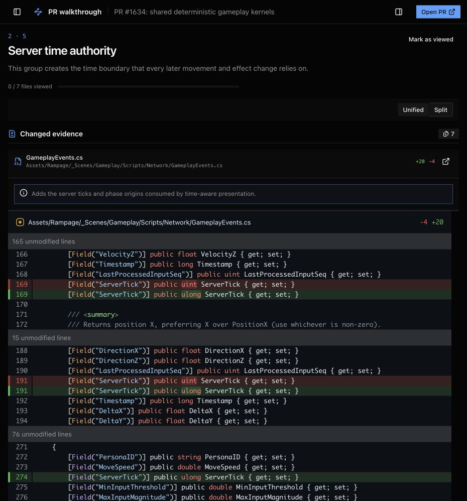

Strengths:

- The group title, intent, evidence count, and first diff form a clear reading path.
- Diffs remain the dominant surface.
- Addition, deletion, and context colors have separate jobs.

Risks:

- `0 / 7 files viewed` is false precision. One group boolean changes every file from unviewed to viewed.
- Unified and Split use two action buttons for one selected state.
- The layout selector sits in a mostly empty card and feels detached from the evidence heading.

Fix:

- Name the state as group-level progress.
- Use shadcn `Toggle` and `ToggleGroup` for selected states.

## 2. Select a review group — mixed

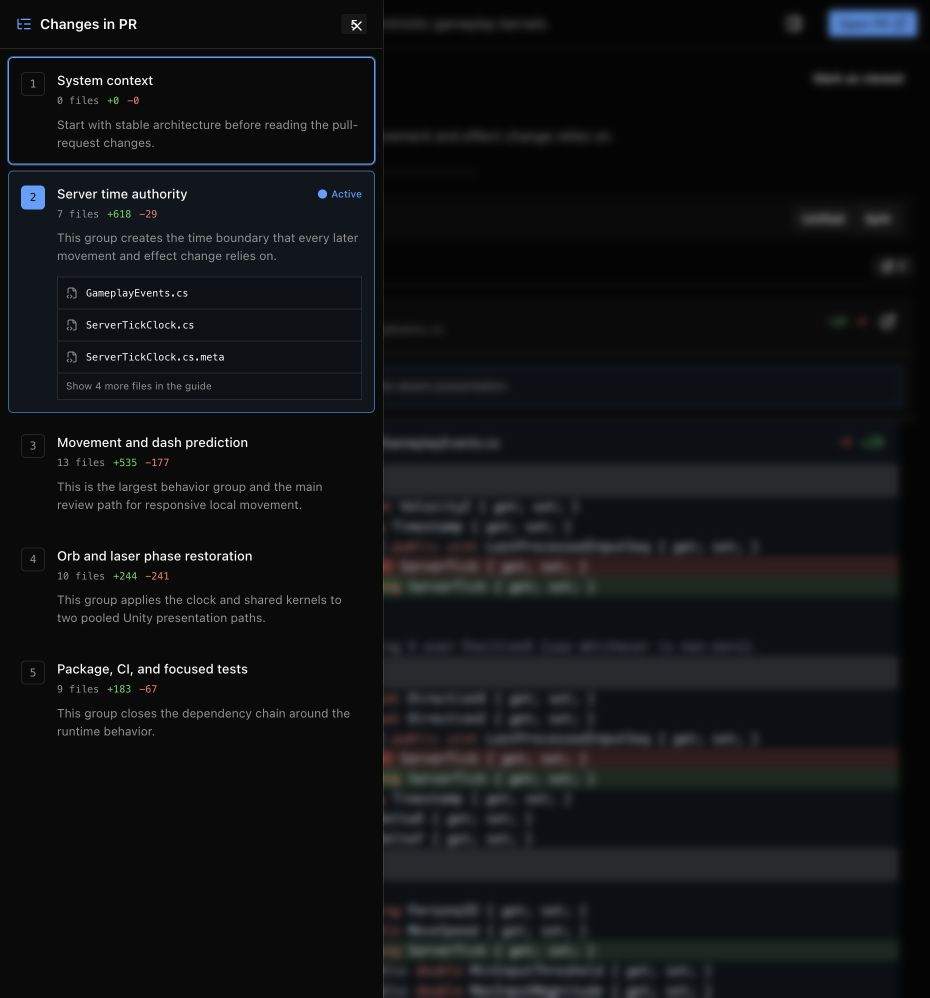

Strengths:

- Groups use reviewer intent, not folders, as the navigation model.
- Active state, file totals, and the short file preview help users estimate review cost.

Risks:

- Each group is a large custom button with hand-built metadata and status treatment.
- The active file preview is another custom bordered list inside that button.
- Status text is small and differs between Active and Viewed.

Fix:

- Use shadcn `ItemGroup`, `Item`, and `Badge` while keeping the complete row clickable.
- Use the compact shadcn `Empty` state when search has no result.

## 3. Inspect evidence and context — mixed

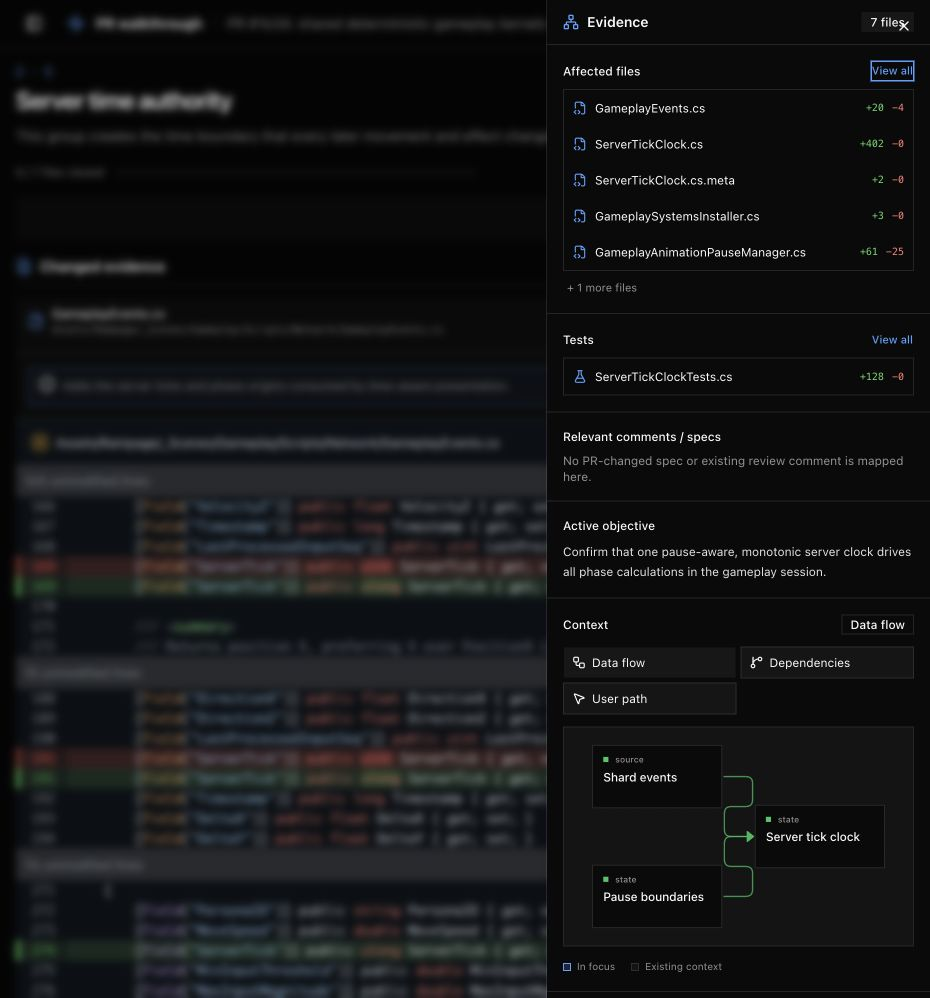

Strengths:

- Evidence comes before the objective and context.
- Files and tests link back to the source diff.
- The relationship view stays secondary to review evidence.

Risks:

- File, test, comment, and empty-state rows use different hand-built layouts.
- Context lenses look like action buttons, although they select one persistent state.
- Empty copy has weak visual hierarchy and changes between sections.

Fix:

- Use shadcn `Item` for evidence rows and mapped comments.
- Use one controlled shadcn `ToggleGroup` for context lenses.
- Use compact shadcn `Empty` components for true no-data states.

## Accessibility evidence

Confirmed from the rendered DOM:

- The page has banner, main, navigation, dialog, progressbar, alert, and labelled button semantics.
- Icon-only navigation buttons have accessible names.
- The group sheet identifies the active group.

Limits:

- Screenshots do not prove keyboard order, focus return, screen-reader announcements, or WCAG contrast compliance.
- The migration must keep visible focus styles and expose selected states through native shadcn primitives.

## Library decision

- Keep the existing shadcn Radix Lyra system. Do not add Base UI as a second primitive stack.
- Keep Trees, Diffs, and React Flow for their specialized surfaces.
- Add only official shadcn `Toggle`, `ToggleGroup`, `Item`, and `Empty` source components.

## Implemented result

### 1. Read a review group — healthy

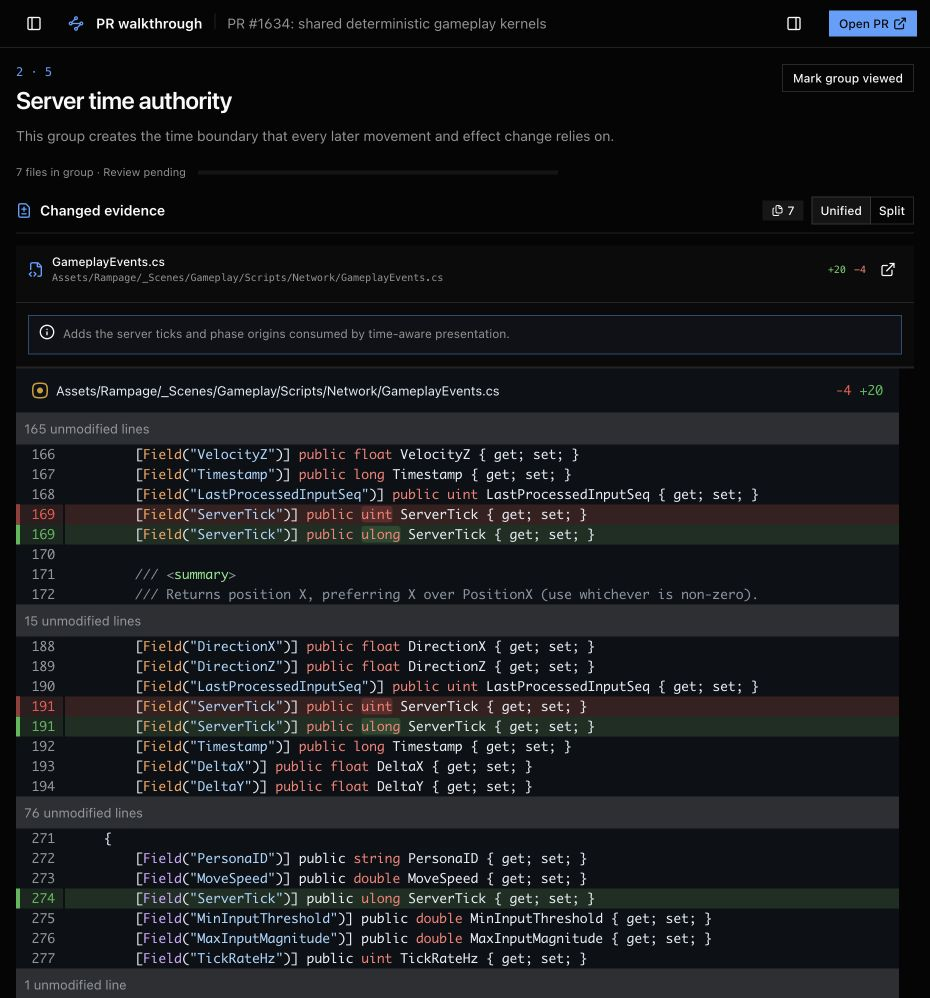

- Group progress now uses honest group-level language.
- `Toggle` controls the viewed state.
- `ToggleGroup` controls the unified or split diff mode.
- The diff control is next to the evidence heading.

### 2. Select a review group — healthy

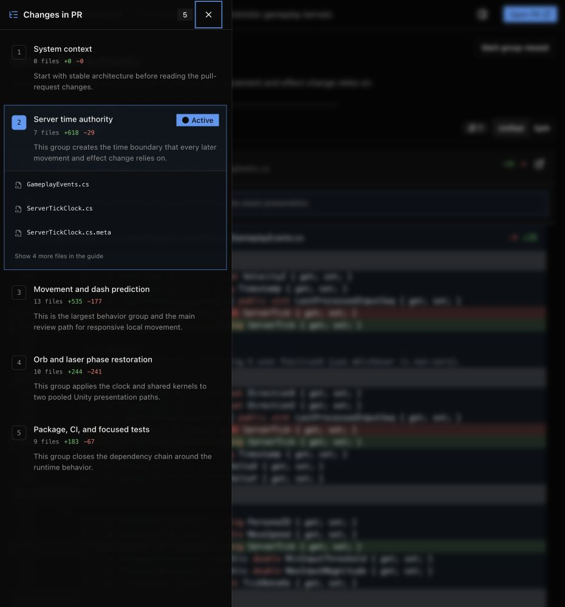

- `ItemGroup` and `Item` provide the row structure.
- `Badge` provides consistent Active and Viewed states.
- The integrated close control does not collide with the file count.

### 3. Inspect evidence and context — healthy

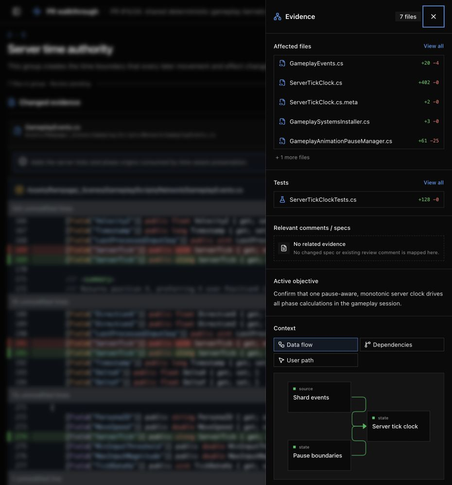

- Evidence and comment rows use `Item`.
- The active context lens appears once and uses `ToggleGroup` state.
- Compact `Empty` states replace custom no-data paragraphs.

### 4. Browse all changed files — healthy

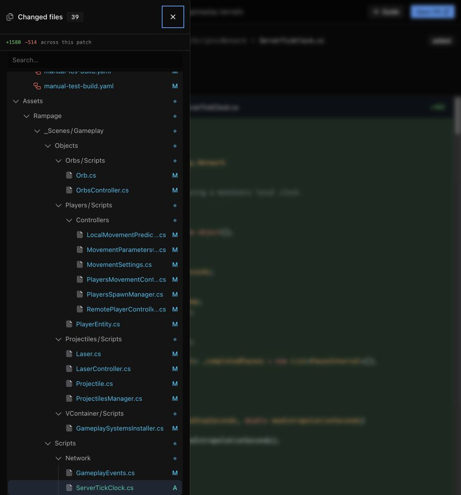

- The file browser remains a specialized Trees and Diffs surface.
- The mobile sheet uses a bounded responsive width.
- Diff content stays inside its horizontal scroll container.

### Responsive workbench — healthy

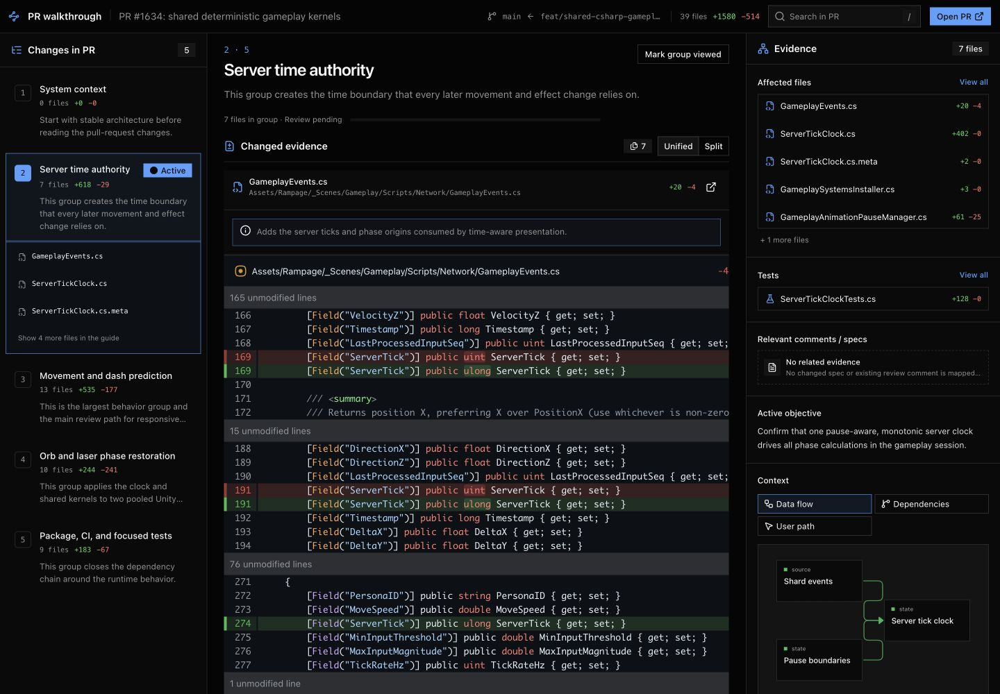

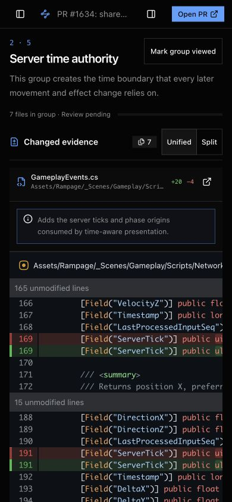

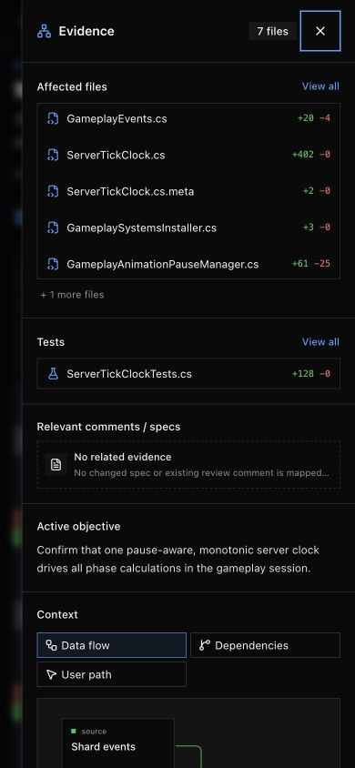

- Desktop uses three bounded workbench columns with no document overflow.
- Mobile keeps panel controls in the navigation bar and uses responsive sheets.
- The page body fills the viewport width at all checked sizes.

## Verification

- `oxlint`: passed.
- TypeScript: passed.
- Next.js production build: passed.
- Desktop: 1440 x 1000, no document overflow.
- Mobile: 390 x 844, no document overflow.
- Browser flows: group selection, group viewed state, diff mode, context lens, evidence jump, Trees selection, and sheet close all passed.
- Screenshot limits remain: manual keyboard and assistive-technology tests are outside this audit.

## Annotated follow-up

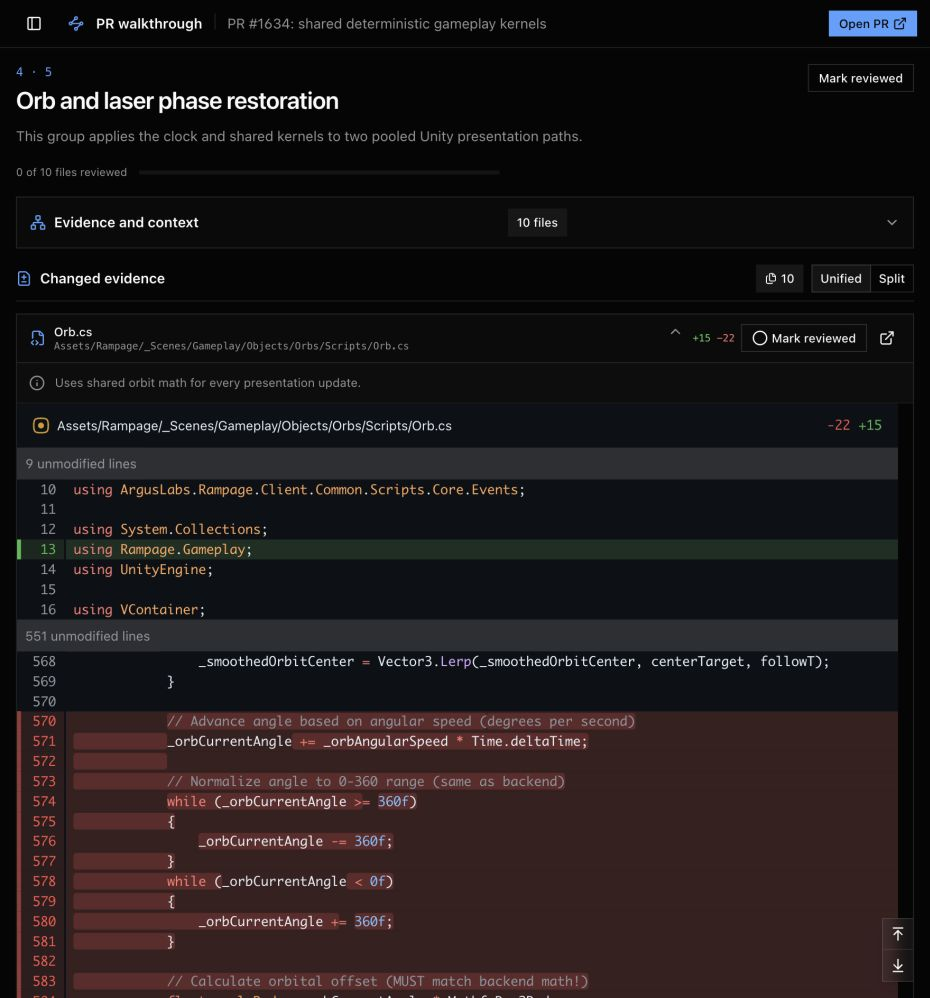

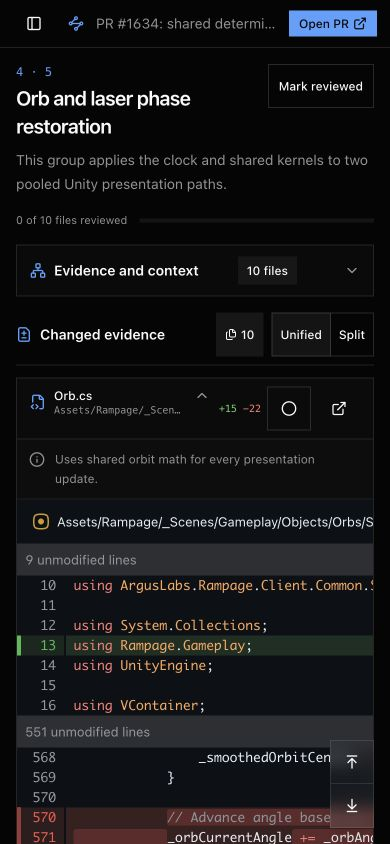

- Every changed file now has a visible border and independent collapse state.
- Every changed file has an independent reviewed toggle. The group action marks or clears all files.
- Pending files use a circle; reviewed files use a check.
- The file note is a flush `Item`, not an alert.
- The changed-file count matches the adjacent diff controls at responsive sizes.
- Below 1280px, Evidence and context is one collapsed inline section above Changed evidence.
- Go to top and Go to bottom remain fixed at the review document's bottom-right edge.
